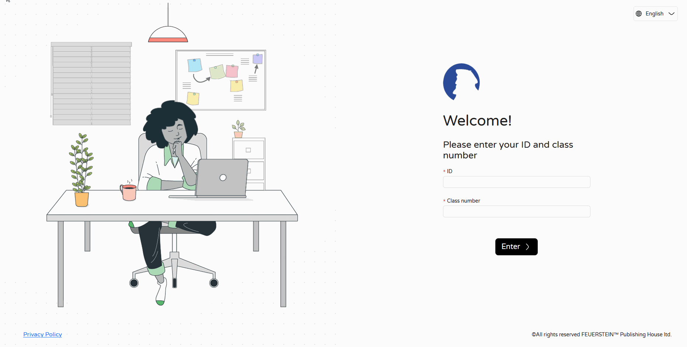
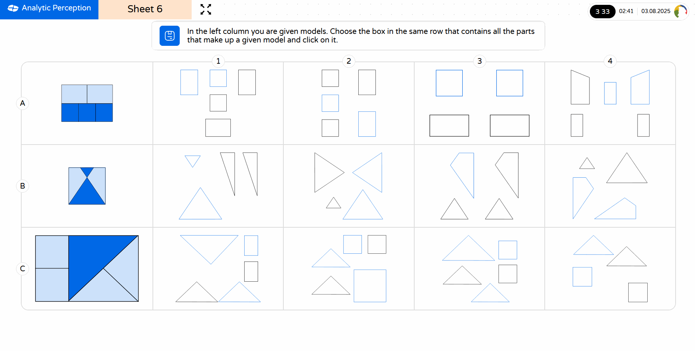

# Feuerstein Dynamic Assessment (LPAD)

> This repository exists for the sole reason of showing my work on the Feuerstein project details in my CV, since the code is private and the website is quite complex I thought I would introduce some of the work using GIFs

### What is it ?
The LPAD is a comprehensive and adaptable dynamic assessment designed to determine an individual’s cognitive strengths and weaknesses. Its purpose is to pinpoint areas requiring further development to enhance cognitive abilities. By providing insight into an individual’s cognitive profile, LPAD results help direct individual and group FIE studies, making it a valuable tool for classrooms and individuals.

- Teachers and examiners can create classes and initiate cognitive assessments

- Students log in and are automatically directed to their current examination, resuming from their assigned test

The examination features 15 different test types, with each test being dynamically customized based on the teacher's assessment goals and the individual student's needs. Students don't necessarily complete all 15 tests, as the system adapts the examination flow accordingly.

Upon completion of the examination, a comprehensive report is automatically generated after analyzing all student responses, with particular emphasis on **incorrect answers**. These incorrect responses provide valuable insights into the student's cognitive processes and thinking patterns.

The generated reports vary significantly based on multiple criteria including the student's age, school context, geographical location, primary language, specific project requirements, learning disabilities, completed test modules, and additional contextual data provided by educators.

[Sample Report](assets/report.pdf)

---

*Note: The LPAD system includes many additional features and capabilities that are difficult to demonstrate through static documentation. This overview provides just a glimpse into the comprehensive functionality of the platform.* 

# Feuerstein Instrumental Enrichment (FIE)

### What is it ?
Feuerstein Instrumental Enrichment (FIE) is a cognitive intervention program that helps improve thinking and learning skills. It includes various tasks specifically designed to be done in a classroom, group, or individual setting. FIE focuses on different mental skills and provides a structured approach to problem-solving. By participating in FIE, learners can enhance their understanding and elaboration of information.

The program consists of an extensive collection of worksheets, each bundled into modules designed for specific cognitive development purposes. The materials are adaptable for a wide age range (10-70 years old) and target various cognitive skills - some worksheets focus on enhancing memory, others assess logical reasoning abilities, and many more address different aspects of cognitive function. 

> Pages are changing in the GIFs because there is a second window where the teacher is controlling the currently viewew worksheet

The system currently contains approximately 80 worksheets, with functionality to assign homework to students. Teachers can provide real-time intervention through the platform itself, offering guidance to help students answer questions or better understand the worksheet content.